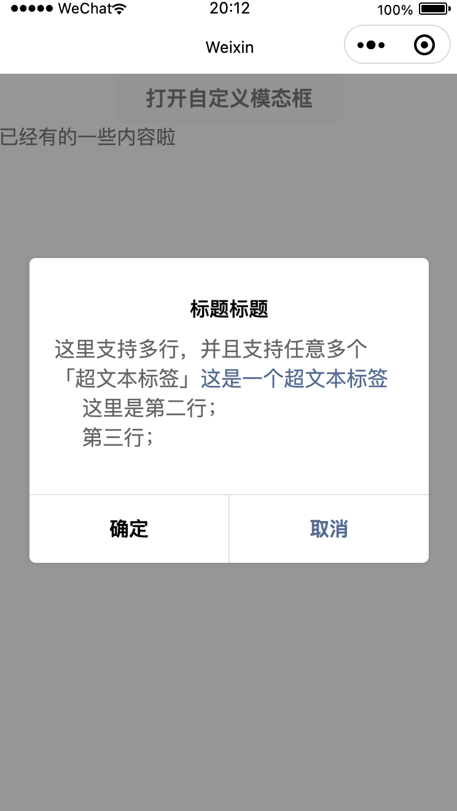
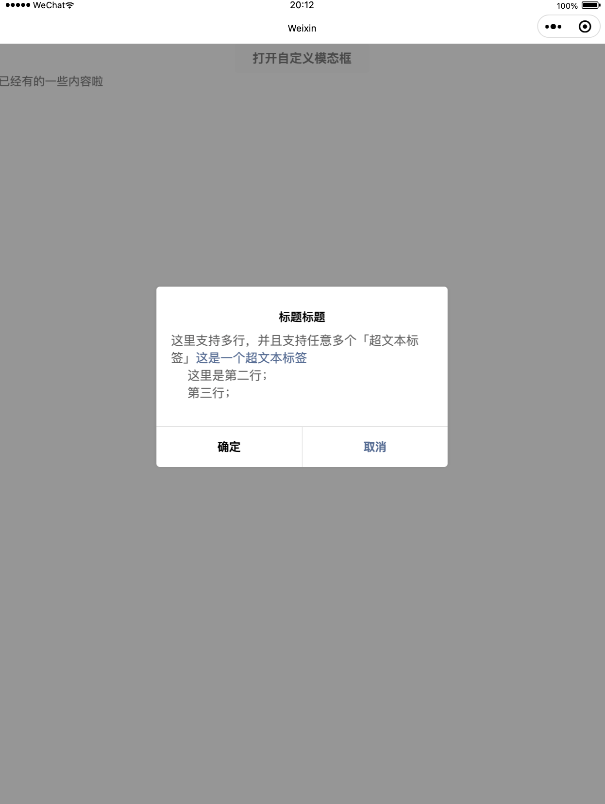

# 仿制的微信小程序模态框

支持超链接标签显示的模态框组件，左图普通手机，右图iPad大屏幕设备。



## 使用指南

复制 `/components` 内文件内容至小程序任意目录下，在需要使用的小程序 Page 页面的 `index.json` 脚本内创建添加如下内容：

```json
{
  "usingComponents": {
    "diymodal":"../../components/diymodal"
  }
}
```

在 `index.wxml` 中使用 `<diymodal></diymodal>`标签即可使用，样例如下：

```html
<diymodal 
          show="{{showModel}}" 
          title="标题内容" 
          content="{{content}}" 
          showCancel="true" 
          cancelText="取消" 
          bind:confrim="yes" 
          bind:cancel="no"
          bind:openurl="openurl"
          >
</diymodal>
```

脚本唤出模态框以及确认按钮与取消按钮的事件监听：

```javascript
Page({
    data: {
        showModel: false,
        content: '',
    },
    openModel() {
        const content = `这里支持多行，并且支持任意多个「超文本标签」<a href="xxxxx">这是一个超文本标签</a>
    这里是第二行；
    第三行；
    `;
        this.setData({
            showModel: true, //弹出模态框
            content,
        })
    },
    yes() {
        console.log('yes')
    },
    no() {
        console.log('no')
    },
    openurl(res) {
        console.log('url:' + res.detail.url);
    }
})
```

## 属性说明

| 属性名       | 类型        | 默认值 | 说明                                                         |
| ------------ | ----------- | ------ | ------------------------------------------------------------ |
| show         | Boolean     | false  | 是否展示模态框，设置为true时将以渐进方式动态展示             |
| title        | String      |        | 模态框标题                                                   |
| content      | String      |        | 正文，支持使用 `<a href="">超文本标签</a>` href 属性需要使用双引号 |
| showCancel   | Boolean     | false  | 是否展示取消按钮                                             |
| cancelText   | String      | 取消   | 取消按钮的文字文案                                           |
| cancelColor  | String      | #000   | 取消按钮的文字颜色                                           |
| confirmText  | String      | 确定   | 确定按钮的文字文案                                           |
| confirmColor | String      | #000   | 确定按钮的文字颜色                                           |
| bind:confirm | eventhandle |        | 确定按钮的回调事件                                           |
| bind:cancel  | eventhandle |        | 取消按钮的回调事件                                           |
| bind:openurl | eventhandle |        | 正文中的超链接标签被点击时的回调事件，事件参数 `res.detail.url` 即为被点击的超链接标签内 `href` 属性值 |

## 反馈意见

直接提 issues 即可